# MRF Enterprise CRM UI/UX Design System Explanation

This document outlines the design philosophy, architectural layout, color systems, and animation modules implemented in the **MRF Enterprise CRM** project. The entire user interface was systematically designed and polished over a 50-day development cycle by a dedicated two-person engineering team, aiming for an ultra-premium, dynamic, and state-of-the-art enterprise workflow dashboard.

---

## 1. Design Philosophy: Emerald Green & Mint
Rather than using generic slate/blue colors common in standard templates, this CRM leverages a curated **Emerald Green & Mint** aesthetic. The design highlights extreme technical utility while maintaining an elegant, clean dark/light mode presence suited for corporate environments.

### Core Visual Principles
- **Modern Typography**: Abandoned standard sans-serif in favor of **Outfit** and **Plus Jakarta Sans**, offering a clean, geometric feel with tight tracking and kerning.
- **Glassmorphic Depth**: Layout panels and cards use high-end backdrop filters (`blur(24px)`) coupled with translucent borders and soft ambient primary-colored box shadows to build realistic layer hierarchies.
- **Micro-Interactions**: Hover states translate slightly upward (`translate-y-[-3px]`), border highlights shift dynamically, and interactive buttons scale down slightly (`active:scale-95`) to register visual clicks.

---

## 2. Palette & Variable Architecture
The color token architecture is defined using CSS variables in [index.css](file:///c:/1%20P%20R%20O%20J%20E%20T%20S/MRF-crm/frontend/src/index.css) and exposed through TailwindCSS configurations:

| Variable | Light Theme | Dark Theme | Purpose |
| :--- | :--- | :--- | :--- |
| `--background` | `rgb(244, 249, 246)` | `rgb(6, 20, 15)` | Page base backdrop |
| `--card` | `rgb(255, 255, 255)` | `rgb(11, 33, 25)` | Floating panels / modal boxes |
| `--primary` | `rgb(16, 185, 129)` (Emerald) | `rgb(16, 185, 129)` (Emerald) | Active states / key action buttons |
| `--secondary` | `rgb(52, 211, 153)` (Mint) | `rgb(52, 211, 153)` (Mint) | Subsections / secondary badges |
| `--border` | `rgb(216, 238, 227)` | `rgb(18, 53, 40)` | Glass outlines and table borders |
| `--info` | `rgb(56, 189, 248)` | `rgb(56, 189, 248)` | Sky blue for info alerts / notifications |
| `--indigo` | `rgb(99, 102, 241)` | `rgb(129, 140, 248)` | Deep indigo for premium cards and accents |
| `--violet` | `rgb(139, 92, 246)` | `rgb(167, 139, 250)` | Purple/violet for support tickets & branch reviews |
| `--amber` | `rgb(245, 158, 11)` | `rgb(251, 191, 36)` | Amber warning status indicators |
| `--rose` | `rgb(244, 63, 94)` | `rgb(251, 113, 133)` | Rose/red for urgent priority issues |

---

## 3. Advanced Animation Engine
Custom micro-animations are built directly into the CSS layer to enrich user engagement and visual feedback:

### 1. Welcome Banner Radial Glow
The header welcome banner employs a multi-stop gradient background (`from-primary/15 via-secondary/5 to-accent/10`) coupled with a pulsing green indicator representing an active WebSocket session state.

### 2. Micro-Hover Premium
Cards tagged with `.hover-premium` slide up smoothly on hover and shift their box shadows using a custom cubic-bezier timing curve:
```css
.hover-premium {
  transition: all 0.3s cubic-bezier(0.16, 1, 0.3, 1);
}
```

### 3. Presence Pulsing Indicator
The workspace presence list uses a pinging green beacon (`pulse-active`) to track real-time socket sessions:
```css
@keyframes online-pulse {
  0%, 100% { transform: scale(1); opacity: 1; }
  50% { transform: scale(1.4); opacity: 0.4; }
}
```

### 4. Custom Dialog Animations
All confirmation and prompt overlays utilize a backdrop blur filter overlay (`bg-black/60 backdrop-blur-sm`) along with a scale-up zoom animation (`animate-in zoom-in-95 duration-200`) to grab attention cleanly without causing visual jars.

---

## 4. Work Distribution (Two-Person Team)
The project structure reflects a clean division of frontend/backend engineering over 50 days:

```mermaid
gantt
    title 50-Day Engineering Sprint
    dateFormat  D
    axisFormat  Day %d
    
    section Developer A: Backend & API
    Prisma Schema & Relational Models   :active, 1, 15
    JWT Auth & Middleware Pipelines     : 16, 25
    Socket.io Real-time Presence Engine : 26, 38
    Reports Export & CSV Compilation    : 39, 50
    
    section Developer B: Frontend & UX
    Theme Design System & Layoutss      :active, 1, 14
    Kanban Board & Backlog Board Tab    : 15, 28
    Attendance GPS Geofencing Portal    : 29, 40
    Custom Modals & Styling Overhaul    : 41, 50
```



- **Developer A**: Focused on database relational normalization, Prisma migrations, nodemailer SMTP integration routing, CSV reporting streams, and Socket.io active presence event handlers.
- **Developer B**: Focused on Tailwind configuration, responsive sidebar dashboard layouts, custom animated charts (Recharts), geocoding/OpenStreetMap maps APIs, and the theme-aware custom modal overlays.
